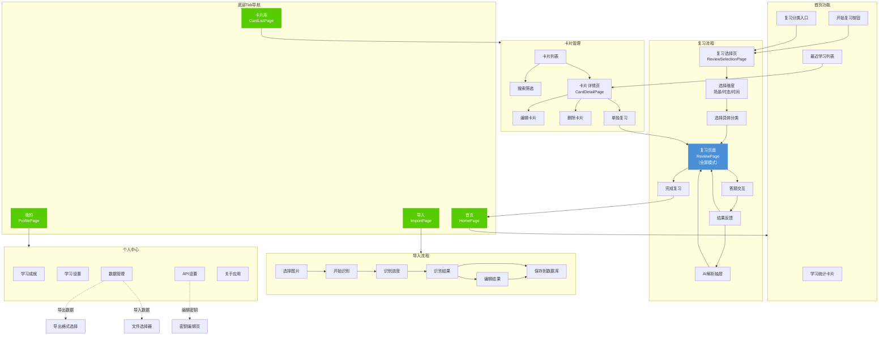
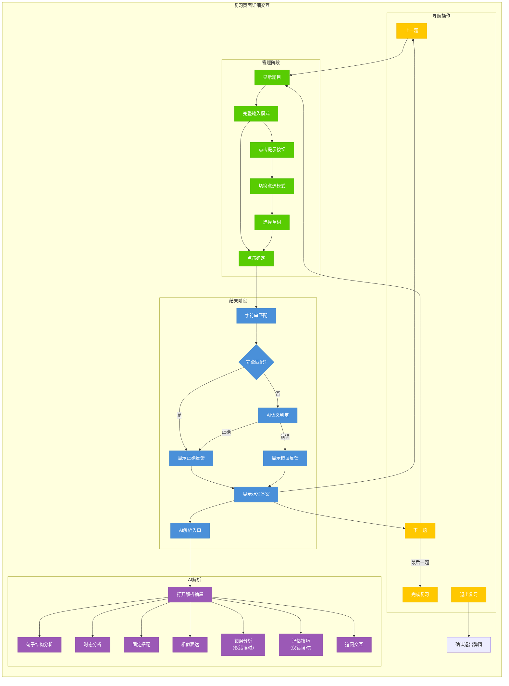

# DUORECALL (多邻记) 产品设计文档

**日期**: 2026-01-31
**版本**: 2.0

---

## 1. 产品定位与核心架构

DUORECALL（多邻记）是一个面向深度学习的AI辅助英语句子记忆应用。产品采用多邻国风格的设计语言，以绿色为主色调，界面圆润友好，降低学习压力。应用不依赖账号登录，所有数据本地存储，支持随时导出备份。

核心架构采用Flutter跨平台开发，使用SQLite作为本地数据库持久化方案。AI服务通过调用硅基流动API实现，包括OCR识别（PaddleOCR/DeepSeek-OCR）、大语言模型处理（Qwen3-8B/DeepSeek-R1）和视觉大模型（GLM-4V）。

应用的主要使用流程是：用户批量导入多邻国截图 → 系统通过混合智能方案识别中英文句子并分类（场景、时态） → 用户选择复习方式（按场景/时态/时间） → 复习时深度学习AI解析 → 数据导出备份。

---

## 2. 图片识别与AI处理流程

图片导入采用混合智能方案以平衡成本和准确率。首先使用视觉大模型（GLM-4V-9B-Thinking）直接处理图片，提取中英文句子并进行分类。视觉模型处理速度更快，能一次性完成识别和结构化提取。仅当视觉模型调用失败或置信度低于阈值时，才降级使用OCR+LLM方案：先用OCR模型（PaddleOCR-VL-1.5或DeepSeek-OCR）提取文本，再交给大语言模型（Qwen3-8B或DeepSeek-R1-0528-Qwen3-8B）进行结构化处理。

大语言模型执行三步任务：1）从中英文混合文本中准确提取句子对（中文和对应的英文）；2）自动分类场景（如旅行、餐厅、工作等）和时态（现在时、过去时、将来时等）；3）将结构化数据保存到SQLite数据库。

时间戳采用混合优先策略：优先从图片EXIF元数据读取拍摄时间，若无则从文件名提取（如Screenshot_2025-12-13格式），最后才使用当前导入时间。这确保了按时间维度复习的准确性。

---

## 3. 复习界面与答题交互

复习界面采用沉浸式学习设计，顶部显示进度条和连对题数徽章，中部是核心答题区域，底部采用悬浮式操作按钮。

答题模式默认为完整手动输入，用户在文本框中输入完整句子。点击"提示"按钮后，当前题目自动切换为点选模式，显示打散的单词列表，用户点击后单词自动移动到上方答题栏。下一题恢复为默认的完整手输模式。

提示功能的打散程度（完全打散、部分有序、分类展示）在全局设置中配置，复习界面不可调整，默认使用部分有序模式，确保适度的学习挑战性。

---

## 4. 答案评判与AI解析

点击"确定"按钮后，系统执行两层评判：首先进行字符串完全匹配，若与标准答案完全一致则立即判定正确；若不一致则调用AI模型（Qwen3-8B或DeepSeek-R1）进行语义判定，AI判定正确即为正确，否则为错误。

无论判定正确与否，都会显示标准正确答案。随后界面显示"查看AI解析"按钮，点击后从底部滑出解析抽屉，默认覆盖界面70%，提供全屏按钮可切换覆盖整个屏幕。

AI解析针对中国人学习英语的特点，无论正确错误都进行详细解读：1）分析英文句子的结构和句子成分；2）解析时态类型和用法；3）列出使用的固定搭配和短语；4）提供相似的表达方式并配上中文翻译。如果回答错误，还会从表达习惯、欧美文化等层面解释错误原因，避免再犯类似错误，并给出记忆技巧建议。

---

## 5. 数据模型与数据库设计

SQLite数据库设计包含以下核心表：

**sentences表**：存储句子卡片数据。字段包括id（主键）、chinese_text（中文文本）、english_text（英文文本）、scene（场景分类）、tense（时态分类）、import_time（导入时间）、source_time（来源时间戳）、image_path（原始图片路径）、ocr_confidence（识别置信度）、retry_count（重试次数）、review_count（复习次数）、hint_count（提示次数）、error_count（错误次数）。

**ai_cache表**：存储AI解析缓存。字段包括id（主键）、sentence_id（关联句子）、cache_type（基础解析/追问对话）、content（解析内容）、created_at（创建时间）、is_expired（是否过期）。基础解析永久保存，追问对话7天后自动过期。

**conversation_history表**：存储追问对话历史。字段包括id（主键）、sentence_id（关联句子）、question（用户问题）、answer（AI回答）、created_at（创建时间）。

**settings表**：存储用户设置。字段包括key（设置键）、value（设置值）。包括hint_mode（提示模式：完全打散/部分有序/分类展示）、input_mode（输入模式：手输/点选）、theme（主题）、siliconflow_api_key（硅基流动API密钥，默认填充文档中的key）等配置。后期可扩展支持其他免费大模型平台（如智谱GLM）。

数据导出支持三种格式：JSON格式用于备份和迁移，CSV格式便于在Excel中查看分析，SQLite数据库文件用于完整恢复。

---

## 6. 分类体系设计

### 6.1 时态分类（16种）

| 序号 | 时态名称           | 英文名称                       | 图标               | 主色    | 示例                        |
| ---- | ------------------ | ------------------------------ | ------------------ | ------- | --------------------------- |
| 1    | 一般现在时         | Simple Present                 | schedule           | #58CC02 | I work every day.           |
| 2    | 一般过去时         | Simple Past                    | history            | #FF9500 | I worked yesterday.         |
| 3    | 一般将来时         | Simple Future                  | update             | #4A90D9 | I will work tomorrow.       |
| 4    | 现在进行时         | Present Continuous             | play_arrow         | #9B59B6 | I am working now.           |
| 5    | 过去进行时         | Past Continuous                | replay             | #E91E63 | I was working then.         |
| 6    | 将来进行时         | Future Continuous              | fast_forward       | #00BCD4 | I will be working.          |
| 7    | 现在完成时         | Present Perfect                | done_all           | #2ECC71 | I have worked here.         |
| 8    | 过去完成时         | Past Perfect                   | done_outline       | #F39C12 | I had worked before.        |
| 9    | 将来完成时         | Future Perfect                 | playlist_add_check | #3498DB | I will have finished.       |
| 10   | 现在完成进行时     | Present Perfect Continuous     | trending_up        | #1ABC9C | I have been working.        |
| 11   | 过去完成进行时     | Past Perfect Continuous        | trending_flat      | #E67E22 | I had been working.         |
| 12   | 将来完成进行时     | Future Perfect Continuous      | trending_down      | #9B59B6 | I will have been working.   |
| 13   | 过去将来时         | Past Future                    | redo               | #7F8C8D | He said he would go.        |
| 14   | 过去将来进行时     | Past Future Continuous         | loop               | #16A085 | He would be sleeping.       |
| 15   | 过去将来完成时     | Past Future Perfect            | check_circle       | #8E44AD | He would have arrived.      |
| 16   | 过去将来完成进行时 | Past Future Perfect Continuous | autorenew          | #2C3E50 | He would have been waiting. |

### 6.2 生活场景分类（30种）

| 序号 | 场景名称 | 英文名称       | 图标              | 主色    | 浅色背景 |
| ---- | -------- | -------------- | ----------------- | ------- | -------- |
| 1    | 日常生活 | Daily Life     | home              | #58CC02 | #EEFAE6  |
| 2    | 餐厅用餐 | Restaurant     | restaurant        | #FF6B00 | #FFF0E6  |
| 3    | 购物消费 | Shopping       | shopping_bag      | #9B59B6 | #F5EBF9  |
| 4    | 旅行出行 | Travel         | flight            | #4A90D9 | #EBF3FC  |
| 5    | 工作职场 | Workplace      | work              | #3498DB | #E8F4FC  |
| 6    | 学校教育 | Education      | school            | #E91E63 | #FCE4EC  |
| 7    | 医疗健康 | Healthcare     | local_hospital    | #F44336 | #FFEBEE  |
| 8    | 交通出行 | Transportation | directions_car    | #607D8B | #ECEFF1  |
| 9    | 住宿酒店 | Accommodation  | hotel             | #795548 | #EFEBE9  |
| 10   | 银行金融 | Banking        | account_balance   | #4CAF50 | #E8F5E9  |
| 11   | 邮局快递 | Post Office    | local_post_office | #FF9800 | #FFF3E0  |
| 12   | 电话通讯 | Telephone      | phone             | #00BCD4 | #E0F7FA  |
| 13   | 天气气候 | Weather        | wb_sunny          | #FFC107 | #FFFDE7  |
| 14   | 时间日期 | Time & Date    | access_time       | #9C27B0 | #F3E5F5  |
| 15   | 家庭亲情 | Family         | family_restroom   | #E91E63 | #FCE4EC  |
| 16   | 朋友社交 | Friendship     | people            | #2196F3 | #E3F2FD  |
| 17   | 爱情约会 | Romance        | favorite          | #F44336 | #FFEBEE  |
| 18   | 运动健身 | Sports         | fitness_center    | #4CAF50 | #E8F5E9  |
| 19   | 娱乐休闲 | Entertainment  | movie             | #673AB7 | #EDE7F6  |
| 20   | 音乐艺术 | Music & Art    | music_note        | #E91E63 | #FCE4EC  |
| 21   | 阅读书籍 | Reading        | menu_book         | #795548 | #EFEBE9  |
| 22   | 科技网络 | Technology     | computer          | #607D8B | #ECEFF1  |
| 23   | 自然环境 | Nature         | park              | #4CAF50 | #E8F5E9  |
| 24   | 动物宠物 | Animals        | pets              | #FF9800 | #FFF3E0  |
| 25   | 节日庆典 | Festivals      | celebration       | #F44336 | #FFEBEE  |
| 26   | 新闻媒体 | News & Media   | newspaper         | #455A64 | #ECEFF1  |
| 27   | 法律政务 | Legal Affairs  | gavel             | #3F51B5 | #E8EAF6  |
| 28   | 面试求职 | Job Interview  | assignment_ind    | #009688 | #E0F2F1  |
| 29   | 租房买房 | Housing        | house             | #8BC34A | #F1F8E9  |
| 30   | 其他场景 | Others         | category          | #9E9E9E | #F5F5F5  |

---

## 7. 界面设计风格与主题

应用采用多邻国风格设计语言，以明亮的绿色为主色调，营造轻松友好的学习氛围。主色使用多邻国标志性的绿色（#58CC02），辅助色包括成功绿（#58CC02）、错误红（#FF4B4B）、警告黄（#FFC800）、中性灰（#E5E5E5）、背景灰（#F7F7F7）。圆角设计贯穿全局，卡片和按钮采用12px-20px圆角，增强亲和力。

字体采用系统默认字体栈，标题使用粗体，正文使用常规字重。图标使用Material Icons，选择圆润风格的图标变体。卡片采用白色背景配以柔和阴影，悬浮状态时轻微上浮，提供触觉反馈。

界面遵循Material Design 3规范，采用现代化的底部导航栏设计。顶部导航栏、卡片、按钮均采用圆润设计，间距宽松（12px-24px），避免拥挤感。

---

## 8. 详细UI设计

### 8.1 应用整体导航结构

**导航架构**：采用底部Tab导航 + 页面栈的混合导航模式

**底部导航栏（全局固定）**
- 高度：60px + 安全区域
- 背景：白色，顶部带0.5px分隔线（#E5E5E5）
- 包含4个导航项，均匀分布
- 选中状态：图标和文字变为主题绿（#58CC02）
- 未选中状态：图标和文字为灰色（#999999）

| Tab | 图标                        | 文字   | 跳转页面     |
| --- | --------------------------- | ------ | ------------ |
| 1   | home_rounded                | 首页   | HomePage     |
| 2   | add_photo_alternate_rounded | 导入   | ImportPage   |
| 3   | library_books_rounded       | 卡片库 | CardListPage |
| 4   | person_rounded              | 我的   | ProfilePage  |

---

### 8.2 首页（HomePage）

**页面定位**：学习入口和数据概览，引导用户快速开始复习

**布局结构（从上到下）**：

1. **顶部状态栏区域**
   - 高度：状态栏高度 + 56px
   - 背景：#58CC02（主题绿）渐变到#4AB600
   - **左侧**：应用Logo（多邻记图标，32px）+ 文字"多邻记"（白色，粗体，20px）
   - **右侧**：通知图标（铃铛，白色，24px，暂无功能，预留）

2. **学习统计卡片区域**
   - 位置：与顶部区域重叠，向下延伸
   - 外边距：水平16px
   - **统计卡片**
     - 背景：白色，圆角16px，阴影（0 4px 12px rgba(0,0,0,0.08)）
     - 内边距：20px
     - 高度：自适应
     - **统计项横向排列**（3列等分）
       - **今日已学**
         - 数字：粗体，28px，#333333
         - 标签：12px，#999999
         - 图标：小火苗，#FF6B00，16px
       - **连续天数**
         - 数字：粗体，28px，#333333
         - 标签：12px，#999999
         - 图标：日历，#58CC02，16px
       - **卡片总数**
         - 数字：粗体，28px，#333333
         - 标签：12px，#999999
         - 图标：卡片，#4A90D9，16px
     - **底部进度提示**
       - 距离统计项：16px
       - 进度条：高度4px，背景#E5E5E5，进度#58CC02，圆角2px
       - 文字："今日目标：已完成 5/10 张"，12px，#666666

3. **快速开始区域**
   - 外边距：水平16px，顶部24px
   - **区域标题**
     - 文字："快速开始"，粗体，18px，#333333
   - **开始复习大按钮**
     - 距离标题：12px
     - 高度：64px
     - 背景：线性渐变（#58CC02 → #4AB600）
     - 圆角：16px
     - 阴影：0 4px 12px rgba(88,204,2,0.3)
     - **布局**：Flex横向
       - **左侧图标区**：学习图标（play_circle_filled），白色，32px
       - **中间文字区**：
         - 主文字："开始复习"，白色，粗体，18px
         - 副文字："继续上次进度"，白色70%透明度，12px
       - **右侧箭头**：箭头图标，白色，24px
     - **点击效果**：按下时缩放0.98，释放时恢复
     - **操作**：跳转到复习选择页面

4. **复习分类入口区域**
   - 外边距：水平16px，顶部24px
   - **区域标题**
     - 文字："选择复习方式"，粗体，18px，#333333
     - 右侧："查看全部 >"，14px，#58CC02，点击跳转复习选择页
   - **分类卡片网格**（2列）
     - 距离标题：12px
     - 间距：12px
     - **卡片样式**（每个）
       - 背景：白色
       - 圆角：12px
       - 阴影：0 2px 8px rgba(0,0,0,0.06)
       - 内边距：16px
       - **图标**：顶部居中，40px，对应分类颜色
       - **标题**：分类名称，粗体，14px，#333333，居中
       - **数量**："23张"，12px，#999999，居中
       - **点击效果**：轻微上浮
       - **操作**：直接进入该分类的复习

     | 卡片 | 图标           | 颜色    | 标题     |
     | ---- | -------------- | ------- | -------- |
     | 1    | category       | #4A90D9 | 按场景   |
     | 2    | schedule       | #FF9500 | 按时态   |
     | 3    | calendar_today | #58CC02 | 按时间   |
     | 4    | shuffle        | #9B59B6 | 随机复习 |

5. **最近学习区域**
   - 外边距：水平16px，顶部24px，底部100px（为底部导航栏留空）
   - **区域标题**
     - 文字："最近学习"，粗体，18px，#333333
     - 右侧："更多 >"，14px，#58CC02，点击跳转卡片库
   - **最近卡片列表**（水平滚动）
     - 距离标题：12px
     - 高度：120px
     - **卡片样式**（每个）
       - 宽度：200px
       - 背景：白色
       - 圆角：12px
       - 阴影：0 2px 8px rgba(0,0,0,0.06)
       - 内边距：12px
       - **中文预览**：14px，#333333，最多2行，超出省略
       - **英文预览**：12px，#666666，最多1行，超出省略
       - **底部标签**：场景标签，小圆角，背景色对应场景
       - **操作**：点击进入卡片详情

---

### 8.3 导入图片页面（ImportPage）

**页面定位**：图片批量导入和AI识别处理

**布局结构（从上到下）**：

1. **顶部导航栏**
   - 高度：56px + 状态栏
   - 背景：白色
   - **左侧**：标题"导入图片"，粗体，18px，#333333
   - **右侧**：帮助图标（help_outline），灰色，24px，点击显示使用说明弹窗

2. **导入引导区域**（无图片时显示）
   - 外边距：水平16px，顶部24px
   - **大型上传区域**
     - 高度：200px
     - 背景：#F7F7F7
     - 边框：2px虚线，#CCCCCC
     - 圆角：16px
     - **居中内容**
       - 图标：add_photo_alternate，64px，#CCCCCC
       - 主文字："点击选择图片"，16px，#666666
       - 副文字："支持多选，建议选择多邻国截图"，12px，#999999
     - **点击操作**：打开系统相册，支持多选

3. **已选图片区域**（选择图片后显示）
   - 外边距：水平16px，顶部16px
   - **区域标题栏**
     - 左侧：文字"已选择 8 张图片"，粗体，16px，#333333
     - 右侧：
       - "继续添加"按钮，文字按钮，14px，#58CC02
       - "清空"按钮，文字按钮，14px，#FF4B4B
   - **图片网格**
     - 距离标题：12px
     - 列数：4列
     - 间距：8px
     - 最大高度：300px，超出可滚动
     - **图片项样式**
       - 宽高比：1:1
       - 圆角：8px
       - **缩略图**：填充模式cover
       - **删除按钮**：右上角，红色小圆圈内白色X，20px，点击移除
       - **序号标签**：左下角，半透明黑色背景，白色数字

4. **识别设置区域**
   - 外边距：水平16px，顶部24px
   - 背景：白色，圆角12px
   - 内边距：16px
   - **折叠标题**
     - 左侧图标：settings，20px，#666666
     - 文字："识别设置"，14px，#333333
     - 右侧：展开/折叠箭头
   - **展开内容**
     - **说明文字**："优先使用视觉模型，失败自动降级到OCR"，12px，#999999
     - **模型选择**（高级用户可切换，默认折叠）

5. **开始识别按钮区域**
   - 外边距：水平16px，顶部24px
   - **主按钮**
     - 高度：52px
     - 背景：#58CC02（有图片时）/ #CCCCCC（无图片时禁用）
     - 圆角：12px
     - 文字："开始识别"，白色，粗体，16px
     - 图标：左侧auto_awesome，白色，20px
   - **提示文字**
     - 距离按钮：8px
     - 文字："识别过程中请勿退出应用"，12px，#999999，居中

6. **识别进度区域**（识别过程中显示，覆盖上方按钮区域）
   - 外边距：水平16px
   - 背景：白色，圆角12px
   - 内边距：20px
   - **进度动画**
     - Lottie动画或自定义动画，表示处理中
     - 尺寸：80px
   - **进度文字**
     - 主文字："正在识别中..."，16px，#333333
     - 副文字："第 3 张 / 共 8 张"，14px，#666666
   - **进度条**
     - 高度：6px，圆角3px
     - 背景：#E5E5E5
     - 进度：#58CC02
   - **取消按钮**
     - 文字按钮："取消识别"，14px，#FF4B4B

7. **识别结果区域**（识别完成后显示）
   - 外边距：水平16px，顶部16px，底部100px
   - **结果统计卡片**
     - 背景：白色，圆角12px
     - 内边距：16px
     - **成功统计**
       - 图标：check_circle，#58CC02，24px
       - 文字："成功识别 6 张"，16px，#333333
     - **失败统计**（如有）
       - 图标：error，#FF4B4B，24px
       - 文字："识别失败 2 张"，16px，#333333
       - "查看详情"链接，14px，#58CC02
   - **预览卡片列表**
     - 距离统计：16px
     - 背景：白色，圆角12px
     - **列表项**（每项）
       - 高度：72px
       - 内边距：12px
       - **左侧缩略图**：48x48，圆角6px
       - **中间文字**
         - 中文预览：14px，#333333，1行省略
         - 英文预览：12px，#666666，1行省略
       - **右侧状态**
         - 成功：绿色勾
         - 失败：红色X，可点击重试
       - **底部分隔线**：0.5px，#E5E5E5
   - **操作按钮组**
     - 距离列表：16px
     - **主按钮**："保存到卡片库"
       - 高度：48px，背景#58CC02，圆角12px
       - 文字：白色，粗体，16px
     - **次按钮**："编辑后保存"
       - 高度：48px，背景白色，边框1px #58CC02，圆角12px
       - 文字：#58CC02，16px
       - 操作：进入编辑页面修正识别结果

---

### 8.4 复习选择页面（ReviewSelectionPage）

**页面定位**：选择复习维度和具体分类

**导航方式**：从首页"开始复习"按钮进入，使用页面栈push

**布局结构（从上到下）**：

1. **顶部导航栏**
   - 高度：56px + 状态栏
   - 背景：白色
   - **左侧**：返回按钮（arrow_back_ios），#333333，24px
   - **中间**：标题"选择复习方式"，粗体，18px，#333333
   - **右侧**：无

2. **搜索栏**
   - 外边距：水平16px，顶部12px
   - 高度：44px
   - 背景：#F5F5F5
   - 圆角：22px（全圆角）
   - **左侧图标**：search，#999999，20px
   - **输入框**：占位文字"搜索场景或时态..."，14px，#999999
   - **操作**：实时过滤下方列表

3. **维度选项卡**
   - 外边距：水平16px，顶部16px
   - 高度：40px
   - **选项卡样式**（横向滑动）
     - 每个选项卡：
       - 内边距：水平16px
       - 圆角：20px
       - **选中态**：背景#58CC02，文字白色，粗体
       - **未选中态**：背景透明，文字#666666
     - 选项：按场景 | 按时态 | 按时间 | 全部随机

4. **分类列表区域**
   - 外边距：水平16px，顶部16px，底部100px
   - **列表容器**
     - 背景：白色
     - 圆角：16px
     - 溢出：滚动
   - **列表项样式**（每项）
     - 高度：68px
     - 内边距：水平16px
     - **左侧图标区**
       - 背景：对应分类的浅色背景
       - 尺寸：44px
       - 圆角：12px
       - 图标：对应分类图标，24px，对应分类主色
     - **中间文字区**
       - 主标题：分类名称，16px，粗体，#333333
       - 副标题："共 23 张卡片"，12px，#999999
     - **右侧**
       - 数量徽章：如"23"，背景#F5F5F5，圆角10px，12px，#666666
       - 箭头：chevron_right，#CCCCCC，20px
     - **底部分隔线**：0.5px，#F0F0F0（最后一项无）
     - **点击效果**：背景变为#F5F5F5
     - **操作**：进入复习页面，加载该分类卡片

5. **空状态提示**（无卡片时显示）
   - 居中显示
   - **插图**：空状态插图，120px
   - **主文字**："暂无卡片"，16px，#333333
   - **副文字**："导入多邻国截图开始学习吧"，14px，#999999
   - **操作按钮**："去导入"，#58CC02，14px，点击切换到导入Tab

---

### 8.5 复习页面（ReviewPage）

**页面定位**：核心学习交互页面，沉浸式答题体验

**导航方式**：从复习选择页面进入，全屏模式，隐藏底部Tab栏

**布局结构（从上到下）**：

1. **顶部状态区域**
   - 高度：状态栏 + 48px
   - 背景：白色
   - **左侧关闭按钮**
     - 图标：close，24px，#666666
     - 点击：弹出确认弹窗"确定退出复习？进度会自动保存"
   - **中间进度区域**
     - **进度条**
       - 宽度：屏幕宽度 - 120px
       - 高度：8px
       - 背景：#E5E5E5
       - 进度：#58CC02
       - 圆角：4px
     - **进度文字**
       - 下方居中："3 / 15"，12px，#999999
   - **右侧连对徽章**
     - 背景：#FFC800
     - 圆角：12px
     - 内边距：6px 10px
     - 图标：local_fire_department，白色，14px
     - 文字："5"，白色，粗体，14px

2. **题目区域**
   - 外边距：水平20px，顶部24px
   - **题目类型标签**（可选显示）
     - 背景：#FF4B4B（挑战题）/ #4A90D9（普通题）
     - 圆角：4px
     - 内边距：4px 8px
     - 文字："挑战题"，白色，12px
   - **任务说明**
     - 距离标签：8px
     - 文字："将下列句子翻译成英文"，14px，#666666
   - **题目内容卡片**
     - 距离说明：16px
     - 背景：#F7F7F7
     - 圆角：16px
     - 内边距：24px
     - **题目文字**
       - 中文或英文句子
       - 字号：20px
       - 颜色：#333333
       - 字重：中等
       - 行高：1.6

3. **答案输入区域**
   - 外边距：水平20px，顶部24px
   - **完整输入模式**（默认）
     - **输入框容器**
       - 背景：白色
       - 边框：2px solid #E5E5E5（未聚焦）/ #58CC02（聚焦）
       - 圆角：12px
       - 最小高度：100px
       - 内边距：16px
     - **输入框**
       - 占位文字："请输入你的答案..."，16px，#CCCCCC
       - 输入文字：16px，#333333
       - 多行，自动增高
     - **键盘配置**
       - 类型：文本
       - 自动大写：句首
       - 自动更正：关闭（避免干扰学习）

   - **点选模式**（点击提示后显示）
     - **答案展示栏**
       - 背景：白色
       - 边框：2px solid #58CC02
       - 圆角：12px
       - 最小高度：60px
       - 内边距：12px
       - **已选单词**：
         - 横向排列，自动换行
         - 每个单词：背景#58CC02，圆角6px，白色文字，内边距4px 10px
         - 间距：6px
         - 点击可取消选择
     - **词库区域**
       - 距离答案栏：16px
       - 背景：#F7F7F7
       - 圆角：12px
       - 内边距：16px
       - **可选单词**：
         - 横向排列，自动换行
         - 每个单词：
           - 背景：白色
           - 边框：1px solid #E5E5E5
           - 圆角：6px
           - 内边距：8px 14px
           - 文字：14px，#333333
           - 阴影：0 1px 2px rgba(0,0,0,0.05)
         - **已选状态**：背景#F0F0F0，文字#CCCCCC
         - 间距：8px
         - 点击动画：轻微缩放

4. **结果反馈区域**（点击确定后显示，替换输入区域）
   - 外边距：水平20px
   - **正确状态**
     - 背景：#E8F8E0（浅绿）
     - 边框左侧：4px solid #58CC02
     - 圆角：12px
     - 内边距：16px
     - **图标和文字**
       - 图标：check_circle，#58CC02，28px
       - 文字："太棒了！"，粗体，18px，#58CC02
     - **标准答案**
       - 标签："标准答案"，12px，#666666
       - 答案文字：16px，#333333
   - **错误状态**
     - 背景：#FEECED（浅红）
     - 边框左侧：4px solid #FF4B4B
     - 圆角：12px
     - 内边距：16px
     - **图标和文字**
       - 图标：cancel，#FF4B4B，28px
       - 文字："再想想！"，粗体，18px，#FF4B4B
     - **用户答案**
       - 标签："你的答案"，12px，#666666
       - 答案文字：16px，#666666，删除线样式
     - **标准答案**
       - 标签："正确答案"，12px，#666666
       - 答案文字：16px，#333333，粗体

5. **AI解析入口**（结果显示后出现）
   - 距离结果区域：16px
   - 外边距：水平20px
   - **解析按钮**
     - 背景：白色
     - 边框：1px solid #E5E5E5
     - 圆角：12px
     - 内边距：12px 16px
     - **布局**：Flex横向，居中
       - 图标：auto_awesome，#58CC02，20px
       - 文字："查看AI解析"，14px，#333333
       - 箭头：expand_more，#999999，20px
     - **点击操作**：展开AI解析抽屉

6. **底部操作区域**
   - 固定在底部
   - 高度：80px + 安全区域
   - 背景：白色
   - 阴影：0 -2px 10px rgba(0,0,0,0.05)
   - 内边距：12px 20px
   - **按钮布局**：
     - **答题阶段**（未提交）
       - 左侧"提示"按钮
         - 宽度：80px，高度：48px
         - 背景：#FFC800
         - 圆角：12px
         - 图标：lightbulb，白色，20px
         - 文字："提示"，白色，14px
       - 右侧"确定"按钮
         - Flex：1（占据剩余空间）
         - 高度：48px
         - 背景：#58CC02（有输入）/ #CCCCCC（无输入禁用）
         - 圆角：12px
         - 文字："确定"，白色，粗体，16px
     - **结果阶段**（已提交）
       - 左侧"上一题"按钮（非第一题时显示）
         - 宽度：80px，高度：48px
         - 背景：#F5F5F5
         - 圆角：12px
         - 图标：arrow_back，#666666，20px
       - 右侧"下一题"/"完成"按钮
         - Flex：1
         - 高度：48px
         - 背景：#58CC02
         - 圆角：12px
         - 文字："下一题" 或 "完成复习"（最后一题），白色，粗体，16px

7. **AI解析抽屉**（点击解析按钮后滑出）
   - **遮罩层**：黑色30%透明度
   - **抽屉容器**
     - 从底部滑入
     - 默认高度：屏幕70%
     - 最大高度：屏幕90%（全屏模式）
     - 背景：白色
     - 顶部圆角：24px
   - **抽屉头部**
     - 高度：56px
     - 内边距：水平20px
     - **拖拽指示条**：居中，宽度40px，高度4px，背景#E5E5E5，圆角2px
     - **标题**："AI解析"，粗体，18px，#333333
     - **全屏按钮**：fullscreen，24px，#666666
     - **关闭按钮**：close，24px，#666666
   - **抽屉内容**（可滚动）
     - 内边距：20px
     - **解析模块**（每个模块）
       - 外边距底部：20px
       - **模块标题**
         - 图标 + 文字
         - 图标：20px，#58CC02
         - 文字：粗体，16px，#333333
       - **模块内容**
         - 距离标题：8px
         - 文字：14px，#666666，行高1.8
         - 代码/术语：背景#F5F5F5，圆角4px，内边距2px 6px

     **解析模块列表**：
     | 模块 | 图标             | 标题     | 内容说明                   |
     | ---- | ---------------- | -------- | -------------------------- |
     | 1    | account_tree     | 句子结构 | 主谓宾等成分分析           |
     | 2    | schedule         | 时态分析 | 时态类型和用法             |
     | 3    | link             | 固定搭配 | 短语和常用搭配             |
     | 4    | compare_arrows   | 相似表达 | 同义句及翻译               |
     | 5    | error_outline    | 错误分析 | 仅错误时显示，解释错误原因 |
     | 6    | tips_and_updates | 记忆技巧 | 仅错误时显示，提供记忆方法 |

   - **追问输入区域**
     - 固定在抽屉底部
     - 背景：白色
     - 阴影：0 -2px 10px rgba(0,0,0,0.05)
     - 内边距：12px 20px
     - **输入框**
       - 背景：#F5F5F5
       - 圆角：22px
       - 高度：44px
       - 内边距：水平16px
       - 占位文字："继续提问..."，14px，#999999
     - **发送按钮**
       - 右侧，圆形，44px
       - 背景：#58CC02
       - 图标：send，白色，20px

**手势交互**：
- 左右滑动：上一题/下一题（结果阶段）
- 下滑抽屉：关闭AI解析
- 上滑抽屉：展开全屏

---

### 8.6 卡片库页面（CardListPage）

**页面定位**：卡片管理和浏览

**布局结构（从上到下）**：

1. **顶部导航栏**
   - 高度：56px + 状态栏
   - 背景：白色
   - **左侧**：标题"卡片库"，粗体，20px，#333333
   - **右侧**：
     - 搜索按钮：search，24px，#666666
     - 更多按钮：more_vert，24px，#666666（菜单：批量编辑、批量删除、导出）

2. **搜索栏**（点击搜索按钮后展开）
   - 动画从顶部展开
   - 高度：56px
   - 背景：白色
   - **输入框**
     - 背景：#F5F5F5
     - 圆角：22px
     - 占位文字："搜索中文或英文..."
   - **取消按钮**：文字按钮，14px，#666666

3. **筛选标签栏**
   - 外边距：水平16px，顶部12px
   - 高度：36px
   - **横向滚动**
   - **标签样式**
     - 内边距：8px 14px
     - 圆角：18px
     - 间距：8px
     - **选中态**：背景#58CC02，文字白色
     - **未选中态**：背景#F5F5F5，文字#666666
   - **标签内容**：全部 | 日常生活 | 餐厅用餐 | 购物消费 | 旅行出行 | ... （动态生成）

4. **排序栏**
   - 外边距：水平16px，顶部12px
   - 高度：32px
   - **布局**：Flex横向
     - **左侧统计**："共 156 张卡片"，14px，#999999
     - **右侧排序**
       - 图标：sort，16px，#666666
       - 文字：当前排序方式，14px，#666666
       - 点击弹出排序选项

   **排序选项**：
   - 导入时间（最新）
   - 导入时间（最早）
   - 复习次数（最多）
   - 错误次数（最多）

5. **卡片列表**
   - 外边距：水平16px，顶部12px，底部100px
   - 列表样式
   - **卡片项样式**（每项）
     - 背景：白色
     - 圆角：12px
     - 阴影：0 2px 8px rgba(0,0,0,0.06)
     - 外边距底部：12px
     - 内边距：16px
     - **左侧场景图标**
       - 背景：对应场景浅色
       - 尺寸：44px
       - 圆角：10px
       - 图标：对应场景图标，24px
     - **中间内容区**
       - **中文文本**：14px，#333333，最多2行省略
       - **英文文本**：13px，#666666，最多1行省略
       - **标签区域**（距离文本8px）
         - 场景标签：背景色对应场景
         - 时态标签：背景#F5F5F5
         - 每个标签：圆角4px，内边距2px 8px，12px
     - **右侧信息**
       - 复习次数：小图标 + 数字，12px，#999999
       - 箭头：chevron_right，#CCCCCC，20px
     - **点击操作**：进入卡片详情页
     - **左滑操作**（可选）：
       - 编辑按钮：蓝色背景
       - 删除按钮：红色背景

6. **浮动添加按钮**
   - 位置：右下角，距离底部导航20px，距离右侧20px
   - 尺寸：56px
   - 背景：#58CC02
   - 阴影：0 4px 12px rgba(88,204,2,0.4)
   - 图标：add，白色，28px
   - 点击：跳转到导入页面

7. **空状态**
   - 居中显示
   - 插图 + 文字 + 操作按钮（同复习选择页）

---

### 8.7 卡片详情页面（CardDetailPage）

**页面定位**：单张卡片的详细信息查看和编辑

**导航方式**：从卡片库点击进入，使用页面栈push

**布局结构（从上到下）**：

1. **顶部导航栏**
   - 高度：56px + 状态栏
   - 背景：白色
   - **左侧**：返回按钮
   - **中间**：标题"卡片详情"
   - **右侧**：
     - 编辑按钮：edit，24px，#58CC02
     - 更多按钮：more_vert，24px，#666666（菜单：删除、分享）

2. **卡片内容区域**
   - 外边距：水平16px，顶部16px
   - 背景：白色
   - 圆角：16px
   - 内边距：20px
   - **场景图标**
     - 居中，尺寸56px，背景对应场景浅色，圆角14px
   - **中文文本**
     - 距离图标：20px
     - 标签："中文"，12px，#999999
     - 内容：18px，#333333，可选中复制
   - **英文文本**
     - 距离中文：16px
     - 标签："英文"，12px，#999999
     - 内容：18px，#333333，可选中复制
   - **分类标签**
     - 距离英文：16px
     - 场景标签 + 时态标签，横向排列

3. **元信息区域**
   - 外边距：水平16px，顶部16px
   - 背景：白色
   - 圆角：16px
   - 内边距：16px
   - **信息项**（每项）
     - 高度：44px
     - **布局**：左侧标签 + 右侧内容
     - 分隔线：0.5px，#F0F0F0
   - **信息列表**：
     - 导入时间：2025-01-15 09:28
     - 来源时间：2025-01-14 20:15
     - 复习次数：3 次
     - 提示次数：1 次
     - 错误次数：2 次

4. **原始图片区域**
   - 外边距：水平16px，顶部16px
   - 背景：白色
   - 圆角：16px
   - 内边距：16px
   - **标题**："原始截图"，粗体，14px，#333333
   - **图片预览**
     - 距离标题：12px
     - 圆角：12px
     - 最大高度：200px
     - 点击查看大图（全屏预览）

5. **AI解析历史区域**
   - 外边距：水平16px，顶部16px，底部100px
   - 背景：白色
   - 圆角：16px
   - 内边距：16px
   - **标题栏**
     - 左侧："AI解析历史"，粗体，14px，#333333
     - 右侧："清空历史"，12px，#999999
   - **历史记录列表**
     - **记录项**（每项）
       - 背景：#F7F7F7
       - 圆角：8px
       - 内边距：12px
       - 外边距底部：8px
       - 时间：12px，#999999
       - 类型标签：基础解析/追问
       - 内容预览：14px，#666666，2行省略
       - 点击展开查看完整内容
   - **空状态**："暂无解析记录"

6. **底部操作栏**
   - 固定底部
   - 高度：70px + 安全区域
   - 背景：白色
   - 阴影：0 -2px 10px rgba(0,0,0,0.05)
   - 内边距：12px 20px
   - **主按钮**："单独复习这张卡片"
     - Flex：1
     - 高度：48px
     - 背景：#58CC02
     - 圆角：12px
     - 文字：白色，粗体，16px

---

### 8.8 我的页面（ProfilePage）

**页面定位**：个人设置和数据管理

**布局结构（从上到下）**：

1. **顶部个人信息区域**
   - 高度：160px
   - 背景：线性渐变（#58CC02 → #4AB600）
   - 内边距：20px
   - **用户信息**
     - 头像：默认头像（多邻国风格鸟），64px，圆形，白色边框
     - 昵称："学习者"，白色，粗体，20px
     - 学习统计："已学习 30 天 · 掌握 156 个句子"，白色70%透明度，14px

2. **学习成就区域**
   - 外边距：水平16px，上移-20px（与顶部区域重叠）
   - 背景：白色
   - 圆角：16px
   - 阴影：0 4px 12px rgba(0,0,0,0.08)
   - 内边距：16px
   - **成就网格**（4列）
     - 每个成就：
       - 图标：32px，对应颜色
       - 数字：粗体，18px，#333333
       - 标签：12px，#999999
   - **成就内容**：
     - 总卡片：156
     - 已掌握：89
     - 连续天数：30
     - 总学习：15小时

3. **设置列表区域**
   - 外边距：水平16px，顶部20px
   - **设置分组**

   **分组1：学习设置**
   - 背景：白色，圆角16px
   - **设置项**（每项高度56px）
     - 提示模式
       - 左侧图标：lightbulb_outline，#666666
       - 标题：14px，#333333
       - 当前值：14px，#999999
       - 右侧箭头
       - 点击弹出选择底部菜单
     - 每日目标
       - 同上样式
       - 当前值：10 张/天

   **分组2：数据管理**
   - 距离上一分组：16px
   - 背景：白色，圆角16px
   - **设置项**：
     - 导出数据
       - 左侧图标：cloud_download_outlined
       - 右侧箭头
       - 点击弹出导出格式选择
     - 导入数据
       - 左侧图标：cloud_upload_outlined
       - 右侧箭头
       - 点击打开文件选择器
     - 清除缓存
       - 左侧图标：cached
       - 当前值：缓存大小，如"12.5 MB"
       - 点击确认后清除

   **分组3：API设置**
   - 距离上一分组：16px
   - 背景：白色，圆角16px
   - **设置项**：
     - 硅基流动API密钥
       - 左侧图标：key
       - 当前值：已设置/未设置
       - 点击进入密钥编辑页面

   **分组4：关于**
   - 距离上一分组：16px
   - 背景：白色，圆角16px
   - **设置项**：
     - 使用帮助
       - 左侧图标：help_outline
     - 隐私政策
       - 左侧图标：privacy_tip_outlined
     - 关于我们
       - 左侧图标：info_outline
       - 当前值：v1.0.0

4. **危险操作区域**
   - 外边距：水平16px，顶部24px，底部100px
   - **清除所有数据按钮**
     - 背景：白色
     - 边框：1px solid #FF4B4B
     - 圆角：12px
     - 高度：48px
     - 文字："清除所有数据"，#FF4B4B，14px
     - 点击：二次确认弹窗

---

### 8.9 弹窗和组件设计

**1. 底部选择菜单（BottomSheet）**
- 圆角：顶部24px
- 背景：白色
- **拖拽指示条**：顶部居中，40x4px，#E5E5E5
- **选项列表**
  - 每项高度：56px
  - 点击态：背景#F5F5F5
  - 选中态：右侧显示绿色勾

**2. 确认对话框（AlertDialog）**
- 圆角：20px
- 背景：白色
- 内边距：24px
- **标题**：18px，粗体，#333333，居中
- **内容**：14px，#666666，居中
- **按钮区域**
  - 间距：12px
  - 取消按钮：背景#F5F5F5，文字#666666
  - 确认按钮：背景#58CC02（或#FF4B4B危险操作），文字白色
  - 按钮高度：44px，圆角10px

**3. Toast提示**
- 位置：底部居中，距离底部导航栏80px
- 背景：#333333
- 圆角：8px
- 内边距：12px 20px
- 文字：14px，白色
- 自动消失：2秒

**4. 加载指示器**
- 类型：圆形进度指示器
- 颜色：#58CC02
- 尺寸：32px
- 可配文字说明

**5. 空状态组件**
- 插图：120px（使用多邻国风格插图或Lottie动画）
- 主文字：16px，#333333
- 副文字：14px，#999999
- 操作按钮：文字按钮，#58CC02

---

## 9. 核心页面导航流程

**导航规则说明**：

1. **底部Tab导航**
   - 4个Tab之间可直接切换
   - 切换时保持各Tab页面状态
   - Tab栏始终固定在底部（复习页面除外）

2. **页面栈导航**
   - 首页 → 复习选择页 → 复习页面
   - 卡片库 → 卡片详情页
   - 我的 → 设置详情页

3. **全屏页面**
   - 复习页面为全屏模式，隐藏底部Tab栏
   - 通过关闭按钮或完成复习返回

4. **抽屉/弹窗覆盖**
   - AI解析抽屉从底部滑出，覆盖70%屏幕
   - 确认对话框居中显示
   - 底部选择菜单从底部滑出

---

## 10. 错误处理与边界情况

AI服务调用失败处理：视觉模型调用失败时自动降级到OCR+LLM方案，OCR失败则提示用户手动输入或重试。大语言模型调用失败时，先检查网络连接，若网络正常则重试最多3次，仍失败则显示友好的错误提示，建议用户检查API密钥或稍后重试。

图片识别边界情况：图片质量过低导致识别失败时，标记为待处理状态，允许用户手动编辑中英文内容和分类。图片无法读取（格式不支持、文件损坏）时，显示错误提示并跳过该图片。识别置信度低于60%时，标记为需要人工确认，在导入结果页面高亮显示。

复习界面边界情况：用户输入为空时点击确定，提示"请输入答案"。用户点击上一题时，保存当前输入状态，返回时可恢复输入。AI解析加载超时（超过10秒）时，显示加载提示，用户可选择继续等待或取消。追问对话时，若AI回答过长，自动截断显示并提供"展开全部"按钮。

数据导出导入边界情况：导出时若存储空间不足，提示用户清理空间后重试。导入数据格式错误时，显示具体错误信息，支持部分导入。导入数据与现有数据冲突时，提示用户选择覆盖或跳过。

---

## 11. 性能优化与用户体验

图片批量导入优化：支持后台队列处理，用户可以在识别过程中继续浏览其他页面。导入进度实时显示，支持取消操作。识别结果采用增量保存，成功一张立即保存一张，避免一次性处理失败导致数据丢失。

AI解析加载优化：解析内容采用预加载策略，用户进入复习页面时预先加载前3题的AI解析缓存。解析抽屉使用懒加载，点击后才渲染内容。长文本内容使用虚拟滚动，避免一次性渲染大量DOM节点。

数据库查询优化：卡片列表分页加载，每页显示20条，滚动到底部自动加载下一页。常用查询（按场景、时态筛选）建立索引，提升查询速度。统计信息缓存，避免每次打开首页都重新计算。

用户体验细节：答题输入框支持自动聚焦，点击输入区域后键盘自动弹出。词库点选模式下，已选中的单词高亮显示，支持点击已选单词取消选择。复习页面支持手势操作，左滑返回上一题，右滑进入下一题。AI解析抽屉支持手势下滑关闭。

启动优化：应用启动时显示加载动画，后台预加载必要的资源和配置。首页数据异步加载，优先显示静态界面，数据加载完成后平滑更新。

---

## 12. 技术栈与依赖包

Flutter核心依赖：使用Flutter SDK 3.10.7及以上版本，确保跨平台兼容性。UI组件使用Material Design 3，配合cupertino_icons支持iOS风格图标。

本地数据库：使用sqflite包（版本2.3.0+）提供SQLite数据库支持，path_provider包（版本2.1.0+）获取应用存储路径。

HTTP请求：使用http包（版本1.1.0+）调用硅基流动API，dio包（版本5.3.0+）处理高级网络请求（拦截器、重试、超时控制）。

图片处理：使用image_picker包（版本1.0.0+）选择图片文件，image包（版本4.0.0+）处理图片压缩和缩略图生成，exif包（版本3.1.0+）读取图片EXIF元数据提取时间戳。

状态管理：使用provider包（版本6.0.0+）进行轻量级状态管理，rxdart包（版本0.27.0+）处理响应式数据流。

工具库：intl包（版本0.18.0+）处理日期格式化，shared_preferences包（版本2.2.0+）存储简单配置，url_launcher包（版本6.1.0+）打开外部链接。

测试依赖：使用flutter_test进行单元测试和widget测试，mockito包（版本5.4.0+）模拟依赖项。

代码质量：使用flutter_lints进行静态代码检查，代码格式遵循Dart官方规范。

---

## 13. AI服务配置

硅基流动API密钥：`sk-wmewhcwoftsdmnyzhzxutcsfgthpfcboogdfutrlrchaaayi`

API文档地址：https://docs.siliconflow.cn/cn/api-reference/chat-completions/chat-completions

可用模型：
- 视觉大模型：THUDM/GLM-4.1V-9B-Thinking
- OCR模型：PaddlePaddle/PaddleOCR-VL-1.5, deepseek-ai/DeepSeek-OCR
- 大语言模型：Qwen/Qwen3-8B, deepseek-ai/DeepSeek-R1-0528-Qwen3-8B

---

## 14. 设计总结

DUORECALL是一款针对中国人学习英语的深度学习应用，通过AI辅助实现智能识别、分类和解析。产品强调深度学习而非快速刷题，通过详细的AI解析帮助用户理解英语句子的结构、时态、固定搭配和文化背景，从表达习惯层面避免常见错误。

产品采用多邻国风格设计，界面友好活泼，降低学习压力。支持灵活的答题模式（完整输入/词库点选）和智能提示（可调节难度）。数据完全本地存储，支持多种格式导出备份，保护用户隐私。

通过混合智能方案平衡成本和准确率，优先使用视觉大模型，失败时降级到OCR+LLM方案。AI解析采用智能缓存策略，基础解析永久保存，追问对话7天过期，兼顾成本和功能。